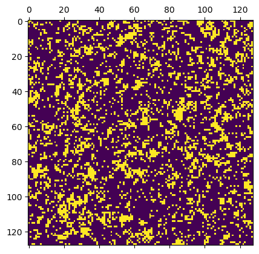
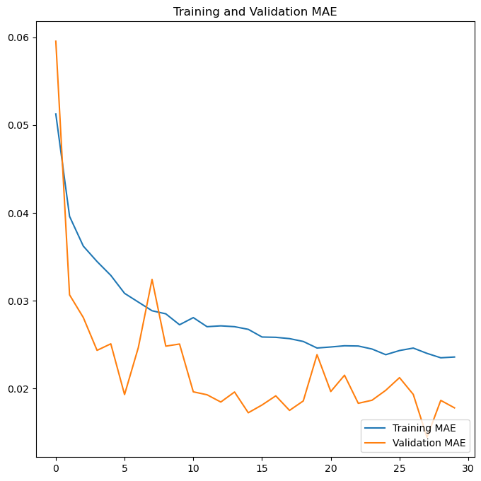
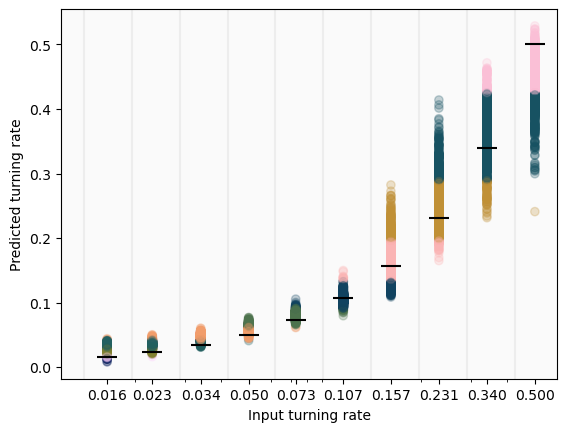
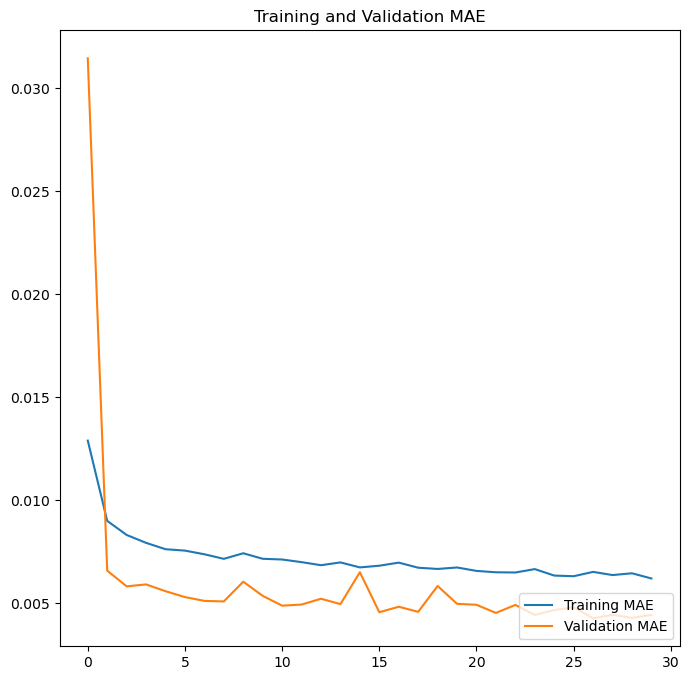
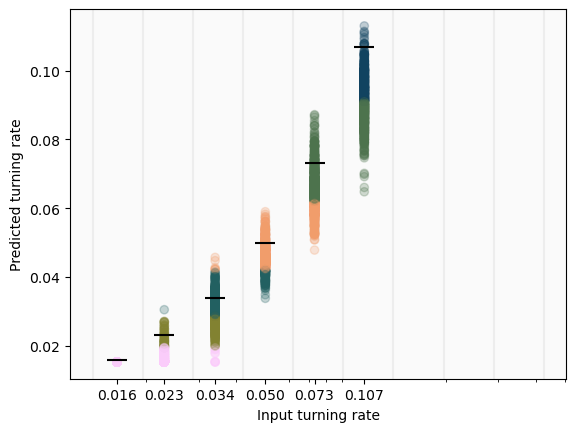
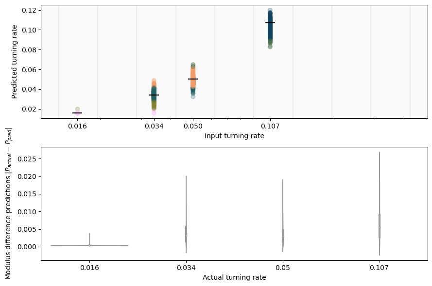
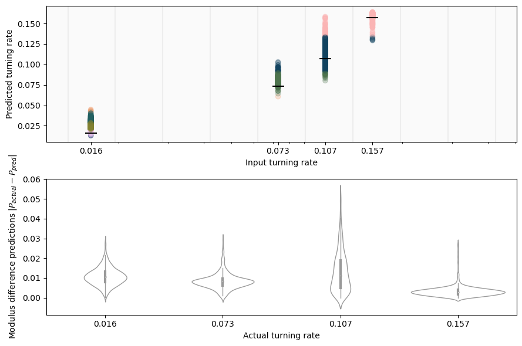
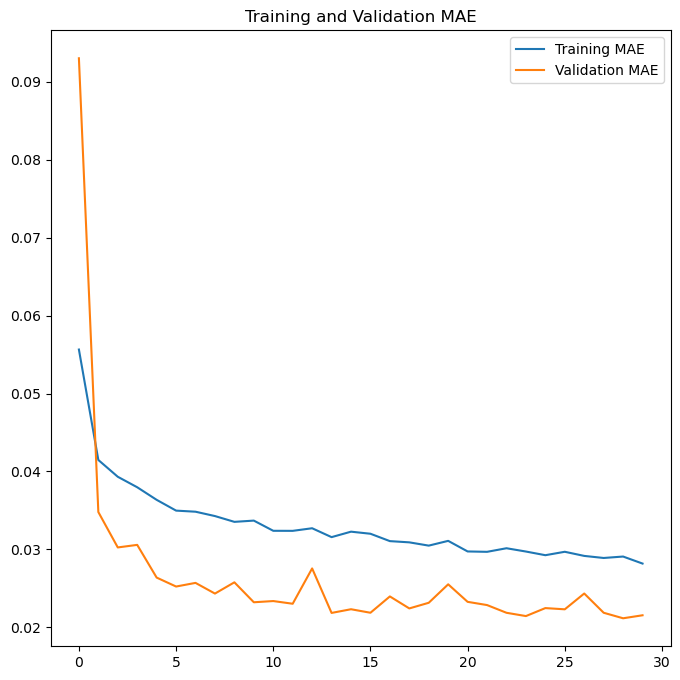
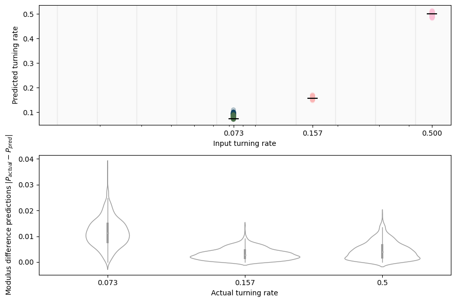
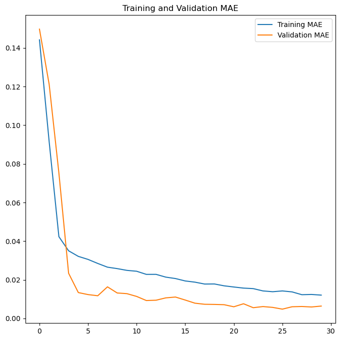

<script type="text/javascript"
  src="https://cdnjs.cloudflare.com/ajax/libs/mathjax/2.7.0/MathJax.js?config=TeX-AMS_CHTML">
</script>
<script type="text/x-mathjax-config">
  MathJax.Hub.Config({
    tex2jax: {
      inlineMath: [['$','$'], ['\\(','\\)']],
      processEscapes: true},
      jax: ["input/TeX","input/MathML","input/AsciiMath","output/CommonHTML"],
      extensions: ["tex2jax.js","mml2jax.js","asciimath2jax.js","MathMenu.js","MathZoom.js","AssistiveMML.js", "[Contrib]/a11y/accessibility-menu.js"],
      TeX: {
      extensions: ["AMSmath.js","AMSsymbols.js","noErrors.js","noUndefined.js"],
      equationNumbers: {
      autoNumber: "AMS"
      }
    }
  });
</script>

# Week 18

# 0. Table of Contents

# 1. Introduction

# 2. Refining CNN Architecture :(

The intermediary convolutional layer in MN_3 was running a (4,4) kernel size; this is uncentered, and therefore slightly hinders the model. We have swapped it out for a (5,5) kernel size.

We could do 'contour plots' of individual clusters to map out how their orientation

# 3. Degrees of Freedom Discussion

We have identified three different changes we could make to the system images before experimenting with the CNN that could pose interesting results.

- Orientation case

- Monochrome case

- Confusion case: This case consists of a random scrambling orientations. The orientation case keeps its orientation categories, but we alter the image such that these categories do not mean anything. Our expectations are that:

	- Training on Confusion case will yield the same result whether validated on Confusion or Orientation case.
	- Training on Orientation case will yield better results when validated on Orientation case, rather than when validated on Confusion case. We expect this because the Orientation case training *should* prime the model to detect an intrinsic feature of the system, which is then completely scrambled by the Confusion case. If our hypothesis is incorrect, and validating on Orientation in fact yields similar results, it would mean that the Orientation case does not pick up on this degree of freedom in its analysis.
	- The Orientation case should overall produce better results than the Confusion case, unless our hypothesis in the last bullet point is false.

- Misinformation case: This case consists of misattributing a random percentage of particle orientations in an Orientation case image. This has physical parallels to misidentifying the orientation of active matter particles from a two-dimensional perception (as they are three-dimensional swimmers). 

- Noise case: This case consists of giving a random (float) noise distribution in a Monochrome case image. The reasoning behind this is granting the CNN the ability to distinguish

# 4. Density Discussion in Big Tumbling Rate Spread
A natural question that arises out of the density analysis done in [Week 17](./week17.qmd) is why the prediction distributions get skewed by the upper probability values. That is to say, why does adding bigger tumbling rates significantly decrease the prediction accuracy and precision?

Our current theory is that higher tumbling rates do not exhibit the clustering behaviour which the CNN is tracking in order to assert its predictions. Once the tumbling rate reaches a certain amount for our $\rho=0.15$ case, it is more difficult for the CNN to draw comparisons, due to the feature landscape dramatically changing. This essentially causes the CNN to misrecognise these different (clustering and non-clustering) ranges of data, across both cases having too small a training sample size to effectively predict the probabilities.

The natural fix for such a problem is more data, but there is some other analysis that can be done to further explore the situation. As stated above, we have so far been working on a density of $\rho=0.15$. Provided our theory is correct, we might notice changes to predictions by *increasing* the density, thus allowing for clustering at higher tumbling rates.

Below is an example of how the landscape looks for $\rho=0.25$. This is a randomly selected image from the pool of utilised probabilities, so its tumbling rate is unknown; nonetheless this image gives a visual idea of the amount of particles on the screen.



#### reverb3164: $\rho=0.25$, $P_{tumble} \in \\{0.016,0.023,0.034,0.050,0.073,0.107,0.157,0.231,0.340,0.500 \\}$, 30 epochs

Predictions             |  Loss Evolution
:-------------------------:|:-------------------------:
  |  

- [ ] MAE: 0.0177948232740164
- [x] Min STD: 0.001830725
- [x] Avg STD: 0.011430472
- [ ] Max STD: 0.030022161
- [ ] Overlap Ratio: 0.7 (acc 1e-3)
- [x] Pearson Coefficient: 0.990001865469512

We can also visually compare reverb3164 (the $\rho=0.25$ case) with stage4124 (the analogous $\rho=0.15$ case):

reverb3164: $\rho=0.25$             |  stage4124: $\rho=0.15$
:-------------------------:|:-------------------------:
  |  

Given that the scales are the same, we can qualitatively notice a decrease in spread (i.e. an increase in accuracy) while jumping from a smaller density to a larger density. This is reflected in our quantitative results:

| Parameter  | reverb3164 | stage4124 |
| ---------- | ---------- | --------- |
| MAE  | 0.017795  | 0.000895 |
| Avg STD  | 0.011430472  | 0.019767912 |
| Max STD  | 0.030022161  | 0.04721327  |
| Overlap Ratio | 0.7 | 1.0 |

We can see that the standard deviations are lower for a bigger density, both on average and regarding maxima. We have, however, included two parameters which are in fact worse in the higher density case: the overlap ratio and the mean absolute error. Regarding the overlap ratio, this is directly tied to the lowering of spread: if we look to the lower density case, we can see that the lower values which are 'hit' there (and which are bareky missed in the higher density case) do not hit so with the centre of their distribution, but rather only with the spread perifery. There is also the issue of the accuracy we've been employing so far for our overlap ratio: 1e-3 is simply too small to account for distributions which do not have a big spread, but are nonetheless within the vicinity of the guessed distribution. We later decided to increase the accuracy to 5e-3; there is an argument to be made that it should be increased even further; in reality the *contents* of these probability distributions matter much more: are they Gaussian? We will see once we introduce violin plots and absolute deviation considerations that this is indeed the case. Furthermore,
how does the *mean* of the distribution relate to the expected value? Within how many standard deviations are they from each other? This will also start to be factored in in the analysis below. 

# 5. Gaps in Lower Tumbling Rates for Higher Densities

We begin by mirroring the cases we explored with $\rho = 0.15$. The thought is that we can show the prior results (again, see [Week 17](./week17.qmd)) are somewhat general by doing so, while also exploring how allowing more clusters to be picked up on across the tumbling rate distributions slightly improves our data.

#### salad8110: $\rho = 0.25$, $P_{tumble} \in \\{0.016,0.023,0.034,0.050,0.073,0.107 \\}$, 30 epochs

Predictions             |  Loss Evolution
:-------------------------:|:-------------------------:
  |  

- [X] MAE: 0.004445969592779875
- [x] Min STD: 1.8626451e-09
- [x] Avg STD: 0.0035765618
- [X] Max STD: 0.0058416952
- [X] Overlap Ratio: 1 (acc 5e-3)
- [x] Pearson Coefficient: 0.9865499725921921

We can now see the prediction distributions that the CNN makes, and get confirmation that they are broadly Gaussian in form. This suggests that a mean analysis of our predictions would accurately reflect the predicttion dynamics at play. Note that the violin plots show specifically the absolute difference between the expected and predicted values, and so values are better the closer they are to zero. We can also see what was previously intuited from the original distribution graphs: the spread does get larger with increased tumbling rates.

We can also see exactly how precise the predictions of the CNN are regarding the lowest value. Rather than a Gaussian, the $P_{tumble}=0.016$ case appears at our scope to be a constant distribution (it is, in actuality, still a Gaussian distribution with an extremely narrow standard deviatiom; the CNN prediction naturally never hits the exact same real number twice).

Beyond that, we can see that the above parameters are still very good. We can once again visually and quantitatively compare with the $\rho = 0.15$ case:

salad8110: $\rho=0.25$             |  balteus3123: $\rho=0.15$
:-------------------------:|:-------------------------:
  |  

| Parameter  | salad8110 | balteus3123 |
| ---------- | ---------- | --------- |
| MAE  | 0.004446  | 0.006792 |
| Avg STD  | 0.0035765618  | 0.00386919 |
| Max STD  | 0.0058416952  | 0.006857624  |
| Overlap Ratio | 1.0 | 1.0 |

And see that once again, the higher density case yields better results over all. Note, of course, that we are discussing differences of magnitude $10^{-3}$ (for MAE and Max STD) and $10^{-4}$ (for Avg STD).

#### crab8432: $\rho = 0.25, P_{tumble} \in \\{0.016,0.034,0.050,0.107 \\}$, 30 epochs

Predictions             |  Loss Evolution
:-------------------------:|:-------------------------:
  |  

- [X] MAE: 0.003553365357220173
- [x] Min STD: 0.00015766203
- [x] Avg STD: 0.0037065577
- [X] Max STD: 0.005531624
- [X] Overlap Ratio: 1.0 (acc 5e-3)
- [x] Pearson Coefficient: 0.9910517414919411

crab8432: $\rho=0.25$             |  goose4421: $\rho=0.15$
:-------------------------:|:-------------------------:
  |  

| Parameter  | crab8432 | goose4421 |
| ---------- | ---------- | --------- |
| MAE  | 0.003553  | 0.004174 |
| Avg STD  | 0.0037065577  | 0.0038618112 |
| Max STD  | 0.005531624  | 0.006754256  |
| Overlap Ratio | 1.0 | 1.0 |

(Note: the overlap ratio for goose4421 was adapted to the new criterion of accuracy 5e-3)

#### summer6911 $\rho = 0.25$, $P_{tumble} \in \\{0.016, 0.073, 0.107, 0.157 \\}$

Predictions             |  Loss Evolution
:-------------------------:|:-------------------------:
  |  

- [X] MAE: 0.008954823948442936
- [x] Min STD: 0.004150052
- [x] Avg STD: 0.0066630687
- [ ] Max STD: 0.013605628
- [X] Overlap Ratio: 1.0 (acc 5e-3)
- [x] Pearson Coefficient: 0.9869872375647769

summer6911: $\rho=0.25$             |  book1634: $\rho=0.15$
:-------------------------:|:-------------------------:
  |  

| Parameter  | crab8432 | book1634 |
| ---------- | ---------- | --------- |
| MAE  | 0.008955  | 0.008299 |
| Avg STD  | 0.0066630687  | 0.007414392 |
| Max STD  | 0.013605628  | 0.013894851  |
| Overlap Ratio | 1.0 | 0.75 |

(Note: the overlap ratio just barely misses book1634 in the $P_{tumble}=0.016$ case even with the 5e-3 extension)

#### salmon9100: $\rho = 0.25$, $P_{tumble} \in \\{0.073,0.107,0.157,0.231,0.34,0.5 \\}$, 30 epochs

Predictions             |  Loss Evolution
:-------------------------:|:-------------------------:
  |  

```
Prediction means and standard deviations.
Actual value 0.073: Average = 0.07637 +- 0.00064; Expected value within 5.309 stdevs of mean
Actual value 0.107: Average = 0.11958 +- 0.01252; Expected value within 1.005 stdevs of mean
Actual value 0.157: Average = 0.16357 +- 0.00663; Expected value within 0.990 stdevs of mean
Actual value 0.231: Average = 0.24277 +- 0.02668; Expected value within 0.441 stdevs of mean
Actual value 0.34: Average = 0.34620 +- 0.03178; Expected value within 0.195 stdevs of mean
Actual value 0.5: Average = 0.44783 +- 0.03338; Expected value within 1.563 stdevs of mean

```

- [ ] MAE: 0.021534917876124382
- [x] Min STD: 0.0006356345
- [x] Avg STD: 0.01860332
- [ ] Max STD: 0.033375088
- [X] Overlap Ratio: 1 (acc 5e-3)
- [x] Pearson Coefficient: 0.9793251812649026


#### tread4399: $\rho=0.25$, $P_{tumble} \in \\{0.073,0.157,0.5 \\}$, 30 epochs

Predictions             |  Loss Evolution
:-------------------------:|:-------------------------:
  |  

```
Prediction means and standard deviations.
Actual value 0.073: Average = 0.08449 +- 0.00540; Expected value within 2.128 stdevs of mean
Actual value 0.157: Average = 0.15972 +- 0.00279; Expected value within 0.973 stdevs of mean
Actual value 0.5: Average = 0.49756 +- 0.00513; Expected value within 0.475 stdevs of mean
```

- [X] MAE: 0.00639208871871233
- [x] Min STD: 0.0027909318
- [x] Avg STD: 0.004439787
- [X] Max STD: 0.0054007815
- [X] Overlap Ratio: 1 (acc 5e-3)
- [x] Pearson Coefficient: 0.999563884360183

#### revolve8117: $\rho=0.25$, $P_{tumble} \in \\{0.073,0.231,0.340,0.500 \\}$, 30 epochs

Predictions             |  Loss Evolution
:-------------------------:|:-------------------------:
  |  

```
Actual value 0.073: Average = 0.09487 +- 0.00837; Expected value within 2.613 stdevs of mean
Actual value 0.231: Average = 0.24794 +- 0.01834; Expected value within 0.924 stdevs of mean
Actual value 0.34: Average = 0.37743 +- 0.05689; Expected value within 0.658 stdevs of mean
Actual value 0.5: Average = 0.49567 +- 0.02125; Expected value within 0.204 stdevs of mean
```

- [ ] MAE: 0.0256530288606882
- [X] Min STD: 0.008370637
- [ ] Avg STD: 0.026211156
- [ ] Max STD: 0.05688635
- [X] Overlap Ratio: 1 (acc 5e-3)
- [ ] Pearson Coefficient: 0.974904538431155

#### flag1899: $\rho=0.25$, $$P_{tumble} \in \\{0.034,0.050,0.073,0.157,0.231 \\}, 30 epochs

Predictions             |  Loss Evolution
:-------------------------:|:-------------------------:
  |  

```
Prediction means and standard deviations.
Actual value 0.034: Average = 0.03666 +- 0.00000; Expected value within inf stdevs of mean
Actual value 0.05: Average = 0.04100 +- 0.00806; Expected value within 1.116 stdevs of mean
Actual value 0.073: Average = 0.07631 +- 0.00551; Expected value within 0.600 stdevs of mean
Actual value 0.107: Average = 0.11042 +- 0.00746; Expected value within 0.458 stdevs of mean
Actual value 0.157: Average = 0.16183 +- 0.01717; Expected value within 0.282 stdevs of mean
Actual value 0.231: Average = 0.22189 +- 0.01270; Expected value within 0.718 stdevs of mean
```

- [X] MAE: 0.00829365104436874
- [X] Min STD: 0.0 !!
- [X] Avg STD: 0.008482912
- [ ] Max STD: 0.017168295
- [X] Overlap Ratio: 1 (acc 5e-3)
- [X] Pearson Coefficient: 0.984593225567436

# 5. Epoch Numbers

compare reverb3164 with remnant3992

# 6. Interpolation and Extrapolation (Monochrome)
