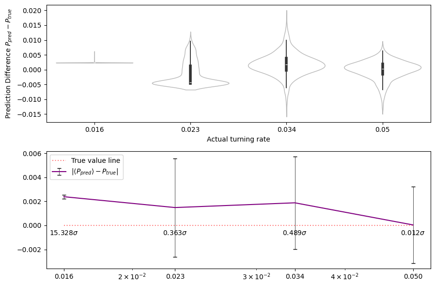
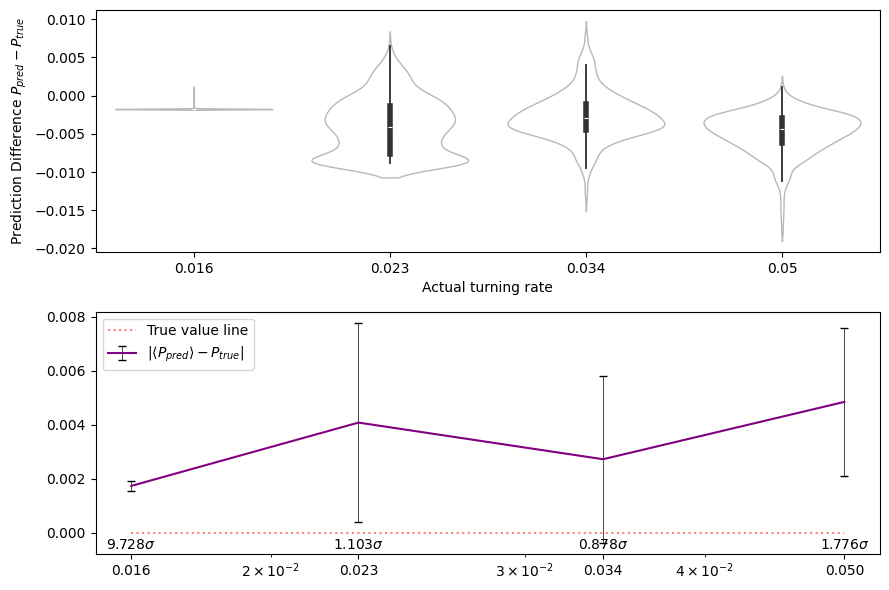
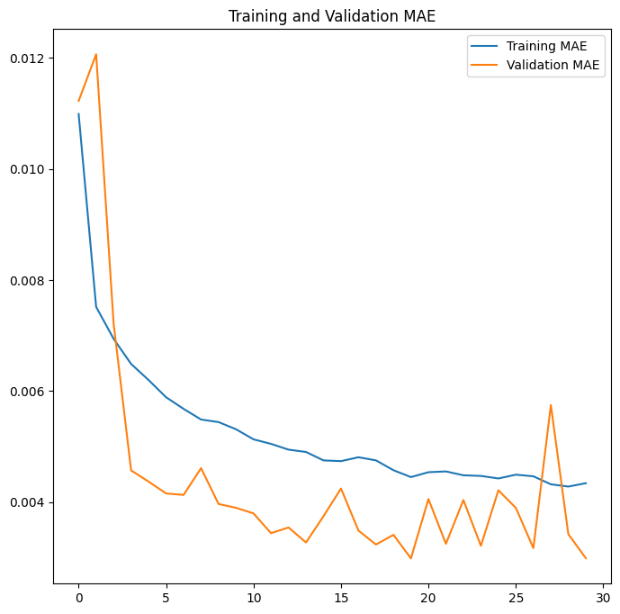
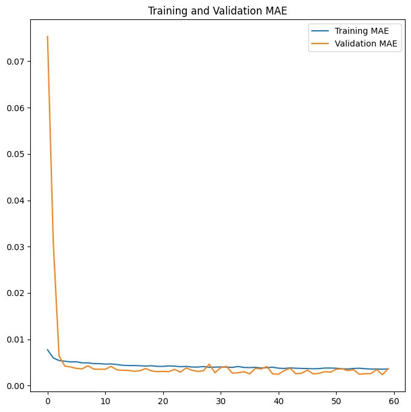
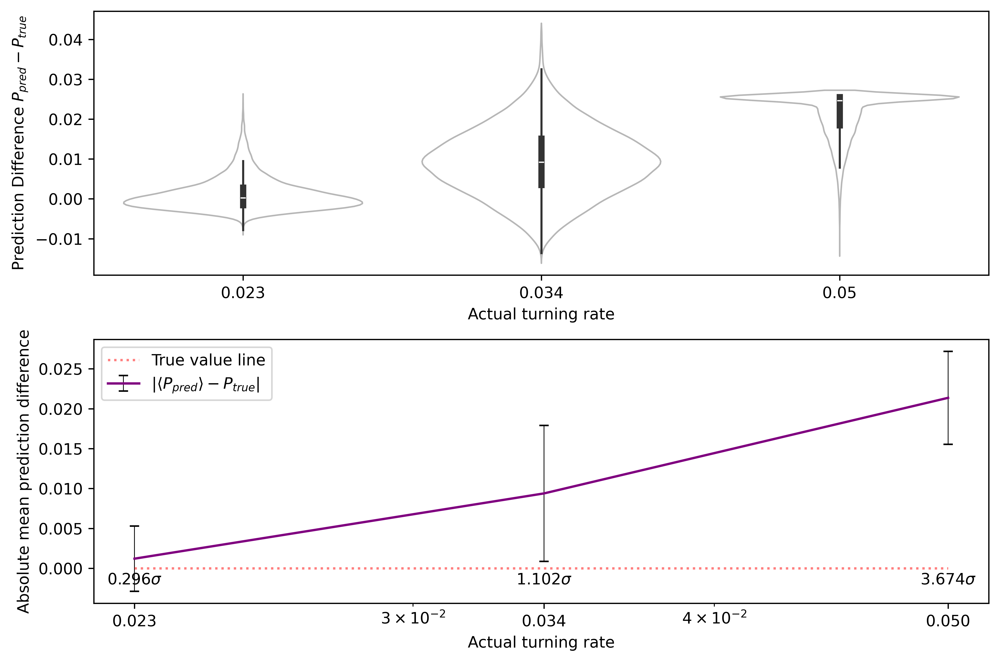
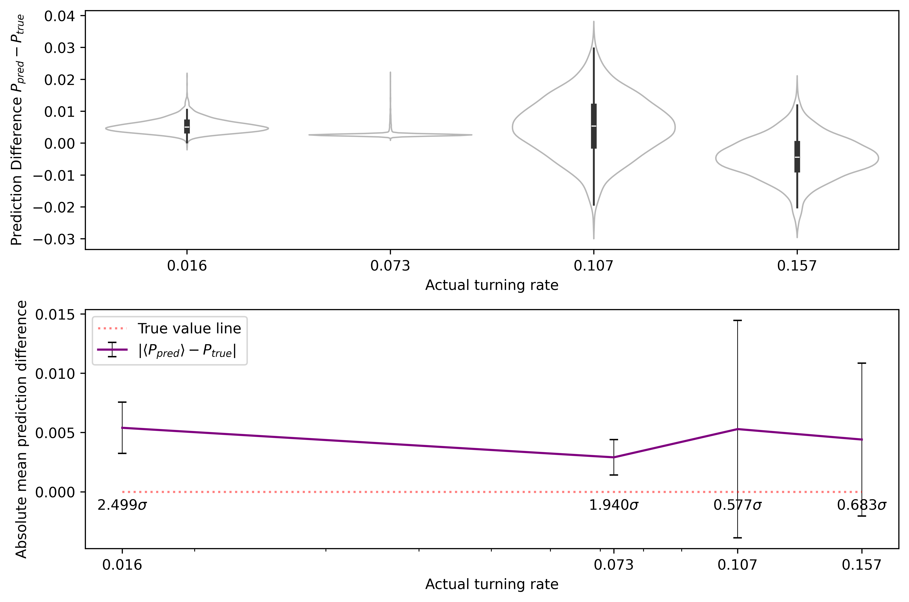

<script type="text/javascript"
  src="https://cdnjs.cloudflare.com/ajax/libs/mathjax/2.7.0/MathJax.js?config=TeX-AMS_CHTML">
</script>
<script type="text/x-mathjax-config">
  MathJax.Hub.Config({
    tex2jax: {
      inlineMath: [['$','$'], ['\\(','\\)']],
      processEscapes: true},
      jax: ["input/TeX","input/MathML","input/AsciiMath","output/CommonHTML"],
      extensions: ["tex2jax.js","mml2jax.js","asciimath2jax.js","MathMenu.js","MathZoom.js","AssistiveMML.js", "[Contrib]/a11y/accessibility-menu.js"],
      TeX: {
      extensions: ["AMSmath.js","AMSsymbols.js","noErrors.js","noUndefined.js"],
      equationNumbers: {
      autoNumber: "AMS"
      }
    }
  });
</script>

# Week 19

# 0. Table of Contents

# 1. Introduction

# 2. Analysis Update

We have finally fixed GPU tensorflow, which greatly accelerates model training.

#### steadfast7653: $P_{t} \in \\{0.016,0.023,0.034,0.050 \\}$, $\rho = 0.25$, 30 epochs ; sardine0022: same, same, 60 epochs

| steadfast7653 (30 epochs)  | sardine0022 (60 epochs)            
:---------------------------------:|:-------------------------:
|  |   |

```
Prediction means and standard deviations for steadfast7653.
Actual value 0.016: Average = 0.01838 +- 0.00016; Expected value within 15.328 stdevs of mean
Actual value 0.023: Average = 0.02152 +- 0.00409; Expected value within 0.363 stdevs of mean
Actual value 0.034: Average = 0.03588 +- 0.00384; Expected value within 0.489 stdevs of mean
Actual value 0.05: Average = 0.04996 +- 0.00318; Expected value within 0.012 stdevs of mean

Prediction means and standard deviations for sardine0022.
Actual value 0.016: Average = 0.01427 +- 0.00018; Expected value within 9.728 stdevs of mean
Actual value 0.023: Average = 0.01892 +- 0.00370; Expected value within 1.103 stdevs of mean
Actual value 0.034: Average = 0.03128 +- 0.00310; Expected value within 0.878 stdevs of mean
Actual value 0.05: Average = 0.04516 +- 0.00273; Expected value within 1.776 stdevs of mean
```

| steadfast7653 (30 epochs)  | sardine0022 (60 epochs)            
:---------------------------------:|:-------------------------:
|  | 

# 3. Higher number interpolations

#### outstretched4188 (antenna4149): $P_{val} \in \\{ \\}$, $P_{train} \in \\{ \\}$

| outstretched4188 (30 epochs)  | antenna4149 (60 epochs)            
:---------------------------------:|:-------------------------:
|  | 


