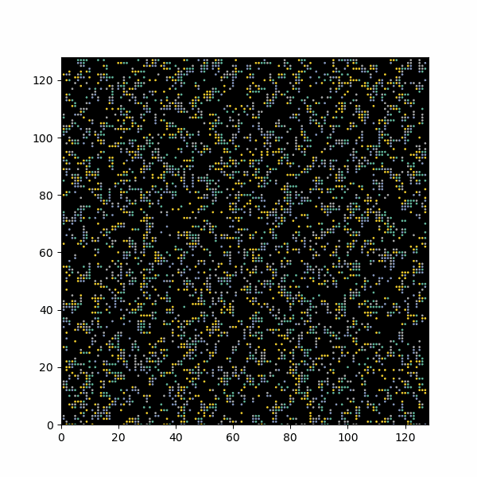
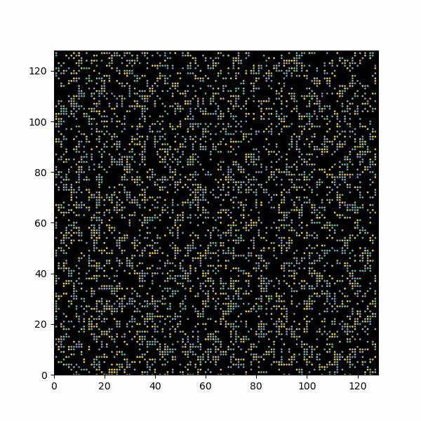
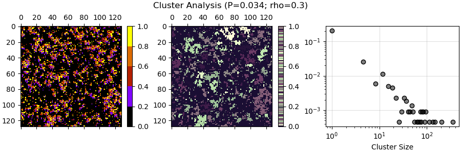

<script type="text/javascript"
  src="https://cdnjs.cloudflare.com/ajax/libs/mathjax/2.7.0/MathJax.js?config=TeX-AMS_CHTML">
</script>
<script type="text/x-mathjax-config">
  MathJax.Hub.Config({
    tex2jax: {
      inlineMath: [['$','$'], ['\\(','\\)']],
      processEscapes: true},
      jax: ["input/TeX","input/MathML","input/AsciiMath","output/CommonHTML"],
      extensions: ["tex2jax.js","mml2jax.js","asciimath2jax.js","MathMenu.js","MathZoom.js","AssistiveMML.js", "[Contrib]/a11y/accessibility-menu.js"],
      TeX: {
      extensions: ["AMSmath.js","AMSsymbols.js","noErrors.js","noUndefined.js"],
      equationNumbers: {
      autoNumber: "AMS"
      }
    }
  });
</script>


Roberto di Leonardo - Feynman's ratchet

asymmetry due to dissipation leads to rectification, conversion into actual work

look into quorum sensing!!

Vicsek

aggregation, maybe phase separation

# Weeks 5-6

# 0. Table of Contents

0. Table of Contents

1. Introduction

2. Persistent Exclusion Process Visualisation

3. Orientation Against Time

# 1. Introduction

These two weeks broadly overlapped with reading week in the arts department; I used a significant portion of this time to catch up on other projects. As such, I have elected to combine these two weeks. This specific log is nonetheless expected to be shorter than the previous ones.

The goals for this week are as follows:

- obtaining a proper graph of varying tumble probability and orientation (by arranging screnshots with various values next to each other)

	- mention a few issues in the code
	
- continue work on the motivational report

# 2. Persistent Exclusion Process Visualisation

It became apparent that the images obtained in [Week 4](./week4.qmd) using the `sampler.py` script to generate static images and the `view.py` script to visualise certain of these static images showed less clustering when compared to the animation in [Week 3](./week3.qmd). Upon closer analysis, the reasoning is due to the way orientation is set up. `lattice.py` (the script that sets up the lattice in which particles move) assigns orientation '0' to the background, in order to assign it a color (black). It then assigns orientations to the moving particles, depending on orientation. However, the orientations assigned to particles are '0', '1', '2', '3'. What this effectively does is give a quarter of the particles the same orientation as the background, thus rendering them invisible. This is a significant information loss.

Another issue is the way I have visualised static lattices in the past. In [Week 4](./week4.qmd) I have opted for downloadable .pdf files, which comes in handy for quick downloading in an unchangeable format (with no potential information loss due to poor quality), but is slightly harder to format. As such the titles are slightly cut off (something I did not notice until much later). I will try to fix it, or otherwise I will switch pack to .png formats.

Below is a general graph (before having fixed the orientation problem) showing how clustering varies with varying tumble probability.

<object data="./week-5-6-files/grid.pdf" type="application/pdf" width="1000px" height="1000px">
123     <embed src="./week-5-6-files/grid.pdf">
124         <p>This browser does not support PDFs.</a>.</p>
125     </embed>
126 </object>

For contrast, this is how a similar graph looks like after having fixed the orientation issues:

<object data="./week-5-6-files/gridcorrect.pdf" type="application/pdf" width="1000px" height="1000px">
123     <embed src="./week-5-6-files/gridcorrect.pdf">
124         <p>This browser does not support PDFs.</a>.</p>
125     </embed>
126 </object>

These are different samples generated for the same values of $P_{tumble}$ and $\rho$. The contrast given by recovering the last 25% of the particles is very stark - some graphs that formerly displayed individual clusters now prove to have them be connected.

Some qualitative analysis:

- low densities do not display clustering for any $P_{tumble}$, as there are not enough particles in the environment to actually cluster

- once density is increased, clustering does occur for certain tumble probability values, as long as density is not too large

- when density $\rho$ gets too large, clustering cannot be said to occur because particles occupy most of the simulation area (and in a sense, they form one big cluster which is trivial for our considerations; we're exploring how autonomous behaviour creates clustering, whereas this clustering is given simply by sheer quantity)

	- this can be counterbalanced by increasing $P_{tumble}$ up to a point - for the selected $\rho$ values this is (mostly) effective, but for a large enough $\rho$ no amount of tumbling will preserve discrete and separate clustering
	
There is still the task of making a 10x10 grid which shows a more elaborate change in clustering across a wider range of values. This can get quite cumbersome and needs to be rendered in a large enough size for the quality to be preserved.

#3. Utility Functions

Below is the script `utils.py` written by my lab partner, which features two utility functions which will come up occasionally in code. They unpack the h5py files in which the persistent exclusion process data is stored, and obtain unique iteration numbers or mean orientations.

```python
"""
Utility functions
"""
import re
import h5py
import numpy as np


def get_ds_iters(key_list: list) -> list:
    """
    Get all the unique iteration numbers

    :param key_list: a list of all the possible dataset keys/names

    :returns: a list of unique iterations
    """
    iter_n = []
    for val in key_list:
        if re.search("^conf_\d+$", val):
            iter_n.append(int(val[5:]))
    return sorted(iter_n)


def get_mean_orientation(file) -> list:
    """
    Get the mean orientation at each iteration

    :param file: the h5 file to open [str]
    :returns: mean orientation [list] of length 1000

    Go through all iteration
    """
    hf = h5py.File(file, "r")
    key_list = list(hf.keys())
    iter_n = get_ds_iters(key_list)
    ori = []
    ori_acm = []
    for idx, val in enumerate(iter_n):
        sshot = np.array(hf[f"conf_{val}"]).flatten()
        avg_ori = np.average(sshot[np.where(sshot != 0)[0]] - 1)
        ori.append(avg_ori)
        ori_acm.append(np.mean(ori))
    return ori_acm
```

#4. Total Orientation Against Time

The next thing to do is to show how the total orientation of the system differs with time. As a quick preliminary demonstration, we can make use of the `video.py` function and the total orientation it displays for every frame. Below are two demonstrations for the same particle density, $\rho=0.3$

### $\rho=0.3; P_{tumble}=0.05$


Real-Space Animation             |  Orientation Frame Analysis
:-------------------------:|:-------------------------:
  |  

### $\rho=0.3; P_{tumble}=0.2$

Real-Space Animation             |  Orientation Frame Analysis
:-------------------------:|:-------------------------:
  |  

The animations only run over 50 frames - this may be too small a sample size to gauge what's actually going on. Nonetheless, some basic traits can be inferred:

- for the $P_{tumble}=0.05$ case, the persistent length is long enough that the system does not fundamentally change; fluctuations in total orientation are quite small, of the order $10^{-4}$

- for the $P_{tumble}=0.2$ case, the persistent length is shorter - this means that the initial state of the system is heavily chaotic, and begins changing rapidly as clusters form. We can observe a stabilisation effect, which slowly brings fluctuations to about the same order of magnitude as the one above

	- note that this is only qualitative analysis so far

#5. Cluster Analysis

The process consists of splitting the particles using neighbour analysis. This is done with `scipy.ndimage`, using a kernel that only engages with vertical and horizontal neighbours (the '1' values) and disregards diagonal neighbours (the '0' values). The justification for this is that particles only have freedom of movement along vertical and horizontal directions; clustering as such emerges when inner particles are prohibited from moving by outer particles. If a particle is present on the diagonal, it cannot be said to contribute to the cluster; as such, it is disregarded.

The code bellow constitutes the main analysis done in this section. It leverages h5py file manipulation and uses a locally-created function (`utils.get_ds_iters`) for obtaining individual iterations from within it. This code is heavily borrowed from my lab partner's [version](https://dlam.mrxl.org/activity_log/week_6.html#cluster-analysis), which in turn makes use of our supervisor's [code](./../shared/ftnotes/label.ipynb).

```python
from scipy import ndimage
import numpy as np
import matplotlib.pyplot as plt
import h5py
import utils
import cmcrameri #for different cmaps

Pt=0.157 #tumble probability
rho=0.3 #particle density
file = ("../data/dataset_tumble_{}_{}.h5".format(Pt,rho)) #change this to analyse different file

cmap1 = plt.get_cmap(name="gnuplot",lut=5) #cmap for first picture
cmap2 = plt.get_cmap(name="cmc.tokyoS") #cmap for second picture
hfile = h5py.File(file,"r")

fig, (regplot, clusterplot, clusterhistogram) = plt.subplots (1,3,figsize=(9,3),width_ratios=(1,1,1.3),constrained_layout=True)

iters = utils.get_ds_iters(hfile.keys())
fig.suptitle("Cluster Analysis (P={}; rho={})".format(Pt,rho))

#plot regular graph
image = hfile[f"conf_{iters[-1]}"]
regplot.matshow(image,cmap=cmap1)

#plot cluster separation graph
kernel = [[0,1,0],
          [1,1,1],
          [0,1,0]]
labelled, nlabels = ndimage.label(image,structure=kernel)
clusterplot.matshow(labelled,cmap=cmap2)

#plot histogram of obtained clusters
cluster_sizes = np.bincount(labelled.flatten())[1:]
bin_edges = np.linspace(cluster_sizes.min(),cluster_sizes.max(),100)
counts, _ = np.histogram(cluster_sizes,bins=bin_edges,density=True)
clusterhistogram.grid(alpha=.4)
clusterhistogram.set_axisbelow(True)
clusterhistogram.scatter(bin_edges[:-1],counts,edgecolor=(0,0,0,1),facecolor=(0,0,0,.5))
clusterhistogram.set_yscale("log"), clusterhistogram.set_xscale("log")
clusterhistogram.set_xlabel("Cluster Size")

fig.colorbar(plt.cm.ScalarMappable(cmap=cmap1),ax=regplot)
fig.colorbar(plt.cm.ScalarMappable(cmap=cmap2),ax=clusterplot)
plt.show()
```

Below are a few results with varying $P_{tumble} and a fixed $\rho=0.3$




#6. Updated Motivational Report

##### For full evolution history of the report, see the [Motivational Report](./../motivational-report/motivational-report.qmd) page.

Active matter is, broadly, a subcategory of condensed matter systems distingushed primarily by energy input homogenously distributed across all constituents (agents) of the system, which in turn set their own self-propelled motion across a medium. The agents therefore have *direct* access to energy, and use it to autonomously propel and direct themselves (with different models and situations allowing for various degrees of freedom). The study of active matter is generally grounded in (but not limited to) observed behaviour of biological agents, as they are the primary (though not only) examples of active matter in nature.

The evident motivation in studying active matter is that it helps understand biological behaviours, and therefore the world of living organisms, where energy is constantly dissipated in order to perform various biological functions. Macroscopically, the construction of theoretical models can help explain, and to a limited degree predict, the behaviour of animals (such as locusts) undergoing collectively-emergent swarming behaviours (where each animal can be treated as its own autonomous agent, sharing the same generally stable ‘rules’ of altering speed and orientation while interacting with each other and the environment)[2]. 

This biological emulation through physical models is not limited to what can be termed ‘simple’ behaviour; human behaviour can be partially mapped and understood within physically-indexed accounts of autonomous choices within (overtly or suggestively) constrained collective action. Interesting examples are swarming behaviours identified in traffic, crowd disasters and concerts[3]. Note however that physical models are sometimes challenged in literature due to potential oversimplifications, insofar as, for instance, cognitive heuristics (the autonomous individual behaviour of a human) under duress might deal holistically, rather than individually, with other human agents[4]. The issue is that most active matter systems only form individual relationships between agents, and do not account for the way an agent interacts with the group as a whole - the resulting individual behaviour is merely a summation of the agent's response to each other agent around it. There are psychological arguments that this is not the case, and that instead humans might under duress conceptualise crowds as a collective, and take actions in relation to the collective itself. This objection rests on the assumption that this holistic heuristic does not *emerge* from individual relations, of course (in which case mapping relationships strictly between individuals is unproblematic).

These insights lead to the exploration of various models. For flocks of birds, individual cogntive heuristics tend to suffice - self-propelled particles with adaptive movement patterns based on neighbours can accurately reproduce some migrational patterns [5]. Microscopically, active matter models offer insight into understanding how hierarchically-organised emergence happens within cell tissues, and how it may be leveraged by medicine[6]. Bacteria lends a great example for exploring the intertwining of phenomena to be emulated by active matter. Some strains (such as *Bacillus subtilis*) can be modelled using both direct physical interaction (between individuals) and long-distance biochemical signalling (within the collective), with complexity and clustering developing in response to harsh external conditions [7]. The latter interaction is called quorum sensing, the adaptation of the individual to local population density; this has developed into its own active matter branch of individual-to-collective behaviour [8]. Using such models, it is possible to recover the aforementioned human holistic cognitive heuristics [9].

Outside of biology, active matter research serves to emulate, or otherwise learn from, naturally-occurring behaviours in order to analyse a potentially more general thermodynamic framework. Due to the necessarily dissipative use of energy within self-organised agents, and their internally-induced behaviour, active matter is not described by the statistical mechanics of equilibrium states. The question then arises whether, through quantitative computation and qualitative modelling/theorising, the thermodynamic laws of equilibria can be modified and generalised to non-equilibrium states. Exploring how these generalisations would hold as departure from equilibrium through various means is increased is then paramount[10]. These generalisations would, ideally, collapse into the known statistical thermodynamics states within the equilibrium limit. These insights, in turn, would facilitate the creation of synthetic active matter, whose potential, although speculatory, ranges from the biomedical application of nanomachine targeted drug delivery possibilities to the location-mapping application of nanoscopic/microscopic enivronmental sensing[11].

The feature in active matter of converting stored and homogenously available energy, such as chemical potential, into mechanical work is also of great importance to the field: understanding how this can work and how to facilitate, among other things, long-term energy access across the active matter substance is a key pursuit of nanotechnology[12]. Statistical and computational models can lend insight into individual and collective dynamics, and in turn give way to new experimental designs of nano/micromechanical systems.


756 words.

#### References

1. Active matter: quantifying the departure from equilibrium. Flenner & Szamel

2. From Disorder to Order in Marching Locusts. Buhl et al. (2006)

3. Collective Motion of Humans in Mosh and Circle Pits at Heavy Metal Concerts. Silverberg et al. (2013)

4. How simple rules determine pedestrian behavior and crowd disasters. Moussaid, Helbing & Theraulaz (2011)

5. Novel Type of Phase Transition in a System of Self-Driven Particles, Vicsek et al. (1995)

6. Active matter at the interface between materials science and cell biology. Needleman & Zvonimir (2017)

7. Formation of complex bacterial colonies via self-generated vortices, Czirok et al. (1996)

8. Self-organization of active particles by quorum sensing rules, Bäuerle et al. (2018)

9. Quorum sensing as a mechanism to harness the wisdom of the crowds, Moreno-Gámez et al. (2023)

10. Phase Separation and Multibody Effects in Three-Dimensional Active Brownian Particles. Turci & Wilding (2021)

11. Nano/Micromotors in Active Matte. Lv, Yank & Li (2022)

12. Catalytic Nanomotors: Autonomous Movement of Striped Nanorods, Paxton et al. (2004)

