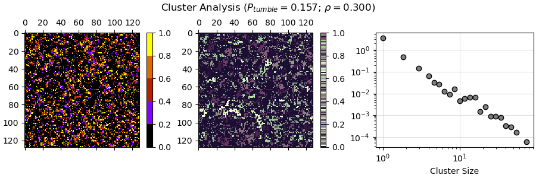

# Week 7

# 0. Table of Contents

0. Table of Contents
1. Introduction
2. 

# 1. Introduction

The aim of this week is mostly to work on the upcoming interim report. As such, most of this week's activity constitutes in gathering data from various papers. A further potential problem in the code was also spotted with regards to how the tumbling rate is established. Beyond that, some minor revisions for the previous week were mentioned.

# 2. Potential Troubles with Tumbling

Examining the code a bit further, we noticed a peculiarity of the tumbling process - on the offchance that a particle does decide to tumble (the probability of which is $P_{tumble}$, it to picks one of the four orientations (0,1,2,3) with equal chance to switch its orientation to. This is an issue, in that the particle has a 25% chance to "tumble in place". This means that $P_{tumble}$ has been consistently off by a factor. The real tumbling rate is:

$$
P_{tumble}^{actual}=\frac{3}{4}P_{tumble}
$$

For now, we will operate with the flawed $P_{tumble}$. I will mention when this is fixed; for this week, at least, $P_{tumble}$ will refer to the flawed tumbling rate, and $P_{tumble}^{actual}$ will refer to the actual tumbling rate.

# 3. Revisions for Last Week

I misunderstood the effect of large densities within run-and-tumble models and what it means for clusters: it isn't that cluster analysis cannot be done due to every particle being joined in the same cluster. Rather, this is where percolation analysis becomes important - will look into it next week further.

There is also the matter of units be established: length can be measured in lattice sites, such as by establishing a lattice site convention as $a$.

This is technically not a revision, but I've updated the cluster analysis grouping graph from last week to also work in log scale. Here is an example, with the histogram bin fitted for log 2:

This is quite similar with the fitting done by Soto and Golestanian in their 2014 paper "Run-and-tumble dynamics in a crowded environment: Persistent exclusion process for swimmers". More comparison and research is needed, though.

# 4. Interim Report Research

I've done a lot of research into the Persistent Exclusion Process, some of its underlying principles (such as the simple exclusion interaction, run and tumble dynamics and the zero range process), Active Brownian Particles (ABP), and the like. I would usually list a classificatory list with sorted information; however, due to illness and most of my project time being allotted to working on the interim report itself, I could not make the list this week.

I will instead make a small list of what I have to look into next week, in anticipation of the deadline:

- general convolutional neural network usage

- further active matter theories

	- active matter field theories
	
		- Model B
		
		- Model B+
		
		- Model H, potentially
		
	- collision active matter theories
	
		- Active Ornstein Uhlenbeck Particles (AOUP)
		
			- compare and contrast with ABPs

- correlation between dissipation and spatial patterns

	- how to study entropy through clusters
	
	- link structure with activity
	
- further research percolation

# 5. Interim Report Progress

<object data="./week-7-files/Interim_Report-3.pdf" type="application/pdf" width="1000px" height="1000px">
     <embed src="./week-7-files/Interim_Report-3.pdf">
         
This browser does not support PDFs.</a>.

     </embed>
 </object>

Many things here are subject to change. This is a combination of the [Motivational Report](./../motivational-report/motivational-report.qmd) from before and the research we have done this week. There are a few places which have to be completed, and the Discussion section is particularly lackluster as of now. The report is currently 1695 words without references.

