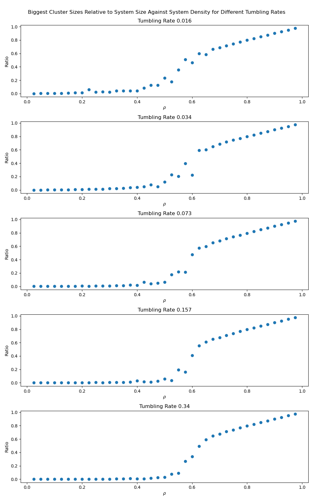
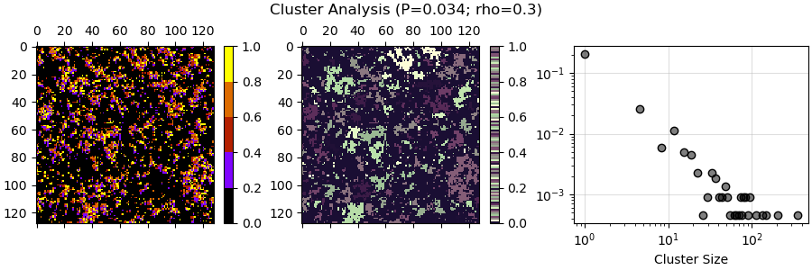

# Weeks 10-13

# 0. Table of Contents

0. Table of Contents
1. Introduction
2. Quanitfying Percolation 
3. Cluster Convergence

# 1. Introduction

# 2. Quantifying Percolation

We can begin to quantify percolation by applying the cluster analysis outlined in [Weeks 5-6](./week5-6.qmd) (specifically subsection 5). By obtaining the size of the biggest cluster, we can see how it varies for different densities - percolation occurs at higher sizes relative to the entire system size (which as of now is still 128x128 lattice sites). The figure below shows such an analysis for different tumbling rates $P_t$.

We can see that the highest possible cluster stagnates around zero for lower densities in all graphs. This means that, while clustering does begin to occur, there are many unconnected and small clusters rather than one big cluster reaching across the entire system. Take the clustering analysis picture from [Weeks 5-6](./week5-6.qmd) below, for instance; we notice obvious non-zero clusters, but they are all individually relatively small to the entire system. This is an evident non-percolation regime.

Where percolation does start being called into question is when the relative percentage of the cluster becomes comparable to the set density. Sticking with the $P_t=0.034$ case, we can see that by $\rho=0.8$, the gradient of the plotted curve becomes distinctly linear. This is precisely because the biggest cluster in the system covers the exact density thereof.

Note of course that the ratio need not exactly cover the density - there is an ambiguous regime where percolation feasibly occurs with most clustering being enmeshed within the same connected cluster, but simply with a lot of agents in constant movement. We can characterise this as the zone around the 'inflection point' within the above graphs.

Note, as well, the inflection region, which is more spread out for a smaller tumbling rate, and conversely is sharper for higher tumbling probabilities.

This, however, is ultimately not a good enough metric for quantifying percolation. While the biggest cluster size analysis would, most of the time, accurately detect non-percolation in lower density regimes, as well as percolation in higher density regimes, it does not account for smaller clusters which nonetheless can perform percolation within the system. All percolation requires in practice is that a cluster unites the vertical or horizontal walls of the lattice. As such, it is feasible (both in theory and in practice) for a smaller size "biggest cluster" to form in a narrow form, which nonetheless unites two parallel walls of the lattice. A better metric to account for percolation is therefore precisely this - checking that the biggest cluster can reach over

This doesn't mean the data obtained above is useless. The analysis is still interesting for seeing how clusters are distributed for many different densities and tumbling rates.
